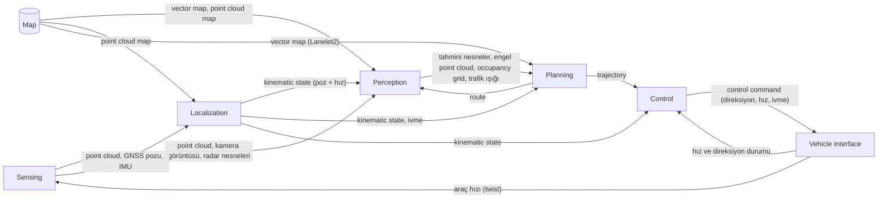
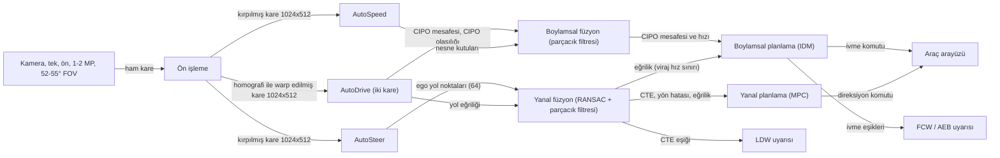

# Mimari Notları

Kaynaklar sabit commit'lere bağlı: Autoware dokümantasyonu `720fdfcc3c` (12 Kas 2026),
VisionPilot reposu `65375ec2cf` (17 Kas 2026). Bulunamayan değer `?` olarak bırakıldı.

## 1. Modüler stack (Autoware)

```mermaid
flowchart LR
    S[Sensing] -->|"point cloud, kamera görüntüsü, radar nesneleri"| P[Perception]
    S -->|"point cloud, GNSS pozu, IMU"| L[Localization]
    L -->|"kinematic state (poz + hız)"| P
    M[(Map)] -->|"vector map, point cloud map"| P
    M -->|"point cloud map"| L
    M -->|"vector map (Lanelet2)"| PL[Planning]
    L -->|"kinematic state, ivme"| PL
    P -->|"tahmini nesneler, engel point cloud, occupancy grid, trafik ışığı"| PL
    PL -->|"route"| P
    PL -->|"trajectory"| C[Control]
    L -->|"kinematic state"| C
    C -->|"control command (direksiyon, hız, ivme)"| V[Vehicle Interface]
    V -->|"hız ve direksiyon durumu"| C
    V -->|"araç hızı (twist)"| S
```

İskelete göre eklenenler: `Map → Perception`, `Planning → Perception` (route), `Localization → Control`
ve araçtan geri besleme okları. `Perception → Localization` oku **yok**: Autoware'de localization
girdileri arasında perception çıktısı bulunmuyor.
Kaynak: [`interfaces/components/`](https://github.com/autowarefoundation/autoware-documentation/blob/720fdfcc3c/docs/design/autoware-architecture-v1/interfaces/components/) altındaki her modülün giriş/çıkış tabloları.

### Arayüz tablosu

| Modül | Giriş | Çıkış | Tipik frekans | Başarısız olursa |
|---|---|---|---|---|
| Sensing | Ham kamera, LiDAR, radar, GNSS, IMU, araç hızı | Düzeltilmiş görüntü, birleştirilmiş point cloud, GNSS pozu, IMU verisi | ? (bir LiDAR turu "100 ms veya daha az" [¹]) | Görüntü tıkanması veya düşük görüş `/diagnostics`'e raporlanır [¹] |
| Perception | Sensing verisi, harita, kinematic state, route | `PredictedObjects`, engel point cloud, occupancy grid, trafik ışığı durumu | 10 Hz (tracker zamanlayıcısı) [²] | Bir sensör kanalı durursa tracker diğer kanallarla devam eder; geç kalan kanal çıktıyı durdurmaz [²] |
| Localization | Point cloud map, point cloud, GNSS, IMU, araç hızı | `kinematic_state` (Odometry), ivme, kovaryanslı poz, tf | 50 Hz veya üzeri; EKF tf'i varsayılan 50 Hz [³] | Hata durumu diagnostics ile error monitor'e gider [³] |
| Planning | Vector map, kinematic state, perception çıktıları, route | `Trajectory`, sinyal/dörtlü komutu | ? (dokümanda bulunamadı) | Geçersiz trajectory'de acil durum tepkisi veya alternatif yol; sensör arızasında MRM: acil duruş, konforlu duruş veya kenara çekme [⁴] |
| Control | `Trajectory`, kinematic state, direksiyon/vites durumu | `Control` komutu (direksiyon açısı, hız, ivme), vites komutu | ~33 Hz (`ctrl_period: 0.03`) [⁵] | Komut yeterince sık gelmezse araç acil duruş yapar; 5 Hz altı uyarı, 1 Hz altı hata [⁶] |
| Vehicle Interface | Control, vites, sinyal komutları | Hız, direksiyon, vites, kontrol modu durumu | Durum mesajları için tasarım hızı 10 Hz [⁷] | Durum geçersizse yayın durur, diagnostics hatası; güvenlik sürücüsü veya acil durdurma butonu devralır [⁷] |
| Map | `.pcd`, Lanelet2 `.osm` dosyaları | Vector map, point cloud map, kısmi harita servisleri | ? (statik veri; periyodik yayın hızı bulunamadı) | ? |

[¹]: https://github.com/autowarefoundation/autoware-documentation/blob/720fdfcc3c/docs/design/autoware-architecture-v1/components/sensing/
[²]: https://github.com/autowarefoundation/autoware-documentation/blob/720fdfcc3c/docs/design/autoware-architecture-v1/components/perception/reference_implementation.md
[³]: https://github.com/autowarefoundation/autoware-documentation/blob/720fdfcc3c/docs/design/autoware-architecture-v1/components/localization/index.md
[⁴]: https://github.com/autowarefoundation/autoware-documentation/blob/720fdfcc3c/docs/design/autoware-architecture-v1/components/planning/index.md
[⁵]: https://github.com/autowarefoundation/autoware-documentation/blob/720fdfcc3c/docs/design/autoware-architecture-v1/interfaces/components/list/control-command-control-cmd.md
[⁶]: https://github.com/autowarefoundation/autoware-documentation/blob/720fdfcc3c/docs/design/autoware-architecture-v1/components/control/index.md
[⁷]: https://github.com/autowarefoundation/autoware-documentation/blob/720fdfcc3c/docs/design/autoware-architecture-v1/components/vehicle/index.md

Gözlem: frekans aşağıdan yukarıya artıyor. Perception 10 Hz, localization ve control 33–50 Hz.
Control'ün planning'den hızlı çalışmasının nedeni 3. bölümdeki 5. soruda.

## 2. VisionPilot

VisionPilot 1.0 ([README](https://github.com/autowarefoundation/autoware.privately-owned-vehicles/blob/65375ec2cf/README.md), mimari görseli
[`Media/VisionPilot_architecture.png`](https://github.com/autowarefoundation/autoware.privately-owned-vehicles/blob/65375ec2cf/Media/VisionPilot_architecture.png)). Aşağıdaki akış
README'den değil, kaynak koddan çıkarıldı: [`VisionPilot/app/vision_pilot.cpp`](https://github.com/autowarefoundation/autoware.privately-owned-vehicles/blob/65375ec2cf/VisionPilot/app/vision_pilot.cpp)
("preprocess → inference → fusion → display").

```mermaid
flowchart LR
    CAM["Kamera, tek, ön, 1-2 MP, 52-55° FOV"] -->|"ham kare"| PRE["Ön işleme"]
    PRE -->|"homografi ile warp edilmiş kare 1024x512"| AD["AutoDrive (iki kare)"]
    PRE -->|"kırpılmış kare 1024x512"| AST["AutoSteer"]
    PRE -->|"kırpılmış kare 1024x512"| ASP["AutoSpeed"]
    AD -->|"CIPO mesafesi, CIPO olasılığı"| LON["Boylamsal füzyon (parçacık filtresi)"]
    ASP -->|"nesne kutuları"| LON
    AST -->|"ego yol noktaları (64)"| LAT["Yanal füzyon (RANSAC + parçacık filtresi)"]
    AD -->|"yol eğriliği"| LAT
    LON -->|"CIPO mesafesi ve hızı"| IDM["Boylamsal planlama (IDM)"]
    LAT -->|"CTE, yön hatası, eğrilik"| MPC["Yanal planlama (MPC)"]
    LAT -->|"eğrilik (viraj hız sınırı)"| IDM
    IDM -->|"ivme komutu"| VI["Araç arayüzü"]
    MPC -->|"direksiyon komutu"| VI
    IDM -->|"ivme eşikleri"| W["FCW / AEB uyarısı"]
    LAT -->|"CTE eşiği"| LDW["LDW uyarısı"]
```

| Katman | Dosya | Not |
|---|---|---|
| Kamera girişi | `VisionPilot/modules/sensing/camera_interface/` | V4L2, video dosyası veya ROS 2 `sensor_msgs/Image`; V4L2 varsayılanı 10 fps (`config/vision_pilot.conf`) |
| Ön işleme | `modules/sensing/image_preprocessing/src/image_preprocessor.cpp` | İki görüntü: homografi warp ve 2:1 kırpma + yeniden boyutlandırma |
| Çıkarım | `modules/models/src/inference.cpp`, `auto_drive.cpp`, `auto_steer.cpp`, `auto_speed.cpp`; `modules/engine/src/onnx_engine.cpp` | Üç model `std::async` ile paralel; ağırlıklar ONNX (fp32, int8) |
| Füzyon | `modules/safety_guardian/fusion/` | **Kalman değil, parçacık filtresi.** Boylamsal: 500 parçacık, [mesafe, hız]; innovation gate ile araya girme (cut-in) tespiti. Yanal: yol noktalarına RANSAC ile 2. derece polinom, CTE/yaw ve eğrilik için parçacık filtreleri |
| Planlama ve kontrol | `modules/safety_guardian/planning/` | Boylamsal: IDM (a=1,5, b=3,0, T=1,5 s, s0=2 m), hız `speed_limit` ve `sqrt(μg/\|κ\|)` ile sınırlı. Yanal: CppAD/IPOPT ile uzamsal MPC (N=20, ds=0,5 m). PID, Stanley veya Pure Pursuit yok |
| Uyarılar | `modules/safety_guardian/planning/src/planning.cpp` | FCW: −5 ≤ a ≤ −3 m/s². AEB: a < −5 m/s². LDW: \|CTE\| > 0,5 m |
| Çıkış | `vehicle_ros2_interface.cpp`, `can_interface.cpp` | ROS 2: `/vehicle/steering_cmd`, `/vehicle/throttle_cmd` (`std_msgs/Float64`). CAN arayüzü şu an boş (`write()` bir şey yapmıyor) |

Kontrol periyodu: `planning/include/planning/config.hpp`'de yorum "50Hz control period" diyor ama
değer `dt = 0.05` s, yani **20 Hz**. Yorum ile değer çelişiyor; gerçek çalışma hızı `?`.
Ana döngü her kamera karesinde bir kez dönüyor.

### Model → özellik tablosu

README modelleri özelliklerle açıkça eşleştirmiyor. Aşağıdaki eşleştirme koddaki veri akışından çıkarıldı.

| Model | Ne tahmin ediyor | Hangi özelliği besliyor | Tek kare mi, ardışık kare mi? |
|---|---|---|---|
| AutoSpeed | En yakın yoldaki nesne (CIPO) adayları: sınıf, skor, kutu (YOLO tarzı) | ACC, FCW, AEB (boylamsal füzyon → IDM üzerinden) | Tek kare |
| AutoSteer | Ego yolun gelecekteki 64 noktası ve her nokta için güven | LKAS, Autopilot direksiyonu (yanal füzyon → MPC), LDW (CTE eşiği) | Tek kare |
| AutoDrive | Uçtan uca: CIPO mesafesi, CIPO var/yok olasılığı, yol eğriliği | Boylamsal: ACC, FCW, AEB. Yanal: eğrilik füzyonu, viraj hız sınırı | **İki kare** (önceki + şimdiki warp edilmiş kare) |

ISA (akıllı hız asistanı) README'de listeleniyor ama kodda sadece sabit `speed_limit = 33,3 m/s` ve
viraj hız sınırı var; trafik işareti tanıyan bir model bulunamadı.

**Bu repoya etkisi:**
- VisionPilot 1.0'ın ana uygulamasında EgoLanes kullanılmıyor. EgoLanes sadece simülasyon örneklerinde geçiyor
  (`Simulation/SODA.Sim/`, `Simulation/CARLA/Zenoh/`). 04 modülü EgoLanes yerine AutoSteer ve AutoDrive'a göre
  güncellenmeli.
- 03'te Kalman filtresi öğrenmek yine doğru temel, ama VisionPilot'un kendisi parçacık filtresi kullanıyor.
  05'teki notlarda "VisionPilot'tan farklar" listesine girer.
- 02'deki PID, Pure Pursuit ve Stanley, VisionPilot'un IDM + MPC'sinin basit karşılıkları.

## 3. Sorular

**1. Modüler stack'te localization neden perception'dan ayrı bir modül? VisionPilot'ta karşılığı var mı?**

Perception, çevredeki nesneleri ve şeritleri araca göre konumlar; localization ise aracın dünyadaki, yani harita üzerindeki konumunu kestirir. İki modülün girdileri, çıktıları ve hata türleri farklı olduğu için ayrı tutulurlar; böylece her biri ayrı test edilip bağımsız olarak değiştirilebilir. Ayrıca algılanan nesneleri haritaya yerleştirebilmek için önce aracın kendi konumunun bilinmesi gerekir. VisionPilot'ta harita tabanlı ayrı bir localization modülü yoktur: algının ürettiği şeride göre konum (yanal sapma e_y ve yön hatası e_ψ) bu işlevi üstlenir.

**2. HD harita kullanan bir sistem ile haritasız tek kameralı sistem arasında ODD nasıl değişir?**

ODD, bir sistemin güvenle çalışmak üzere tasarlandığı koşulların tanımıdır. HD haritalı bir sistem yalnızca önceden haritalanmış ve haritası güncel bölgelerde çalışabilir; buna karşılık yol geometrisini önceden bildiği için şerit çizgileri silik olduğunda ya da görüş kötüleştiğinde daha dayanıklıdır. Haritasız tek kameralı sistem ise o an kameranın gördüğüne dayandığından şerit çizgileri görünen her yolda çalışabilir, ama ODD'si yağmur, gece, karşıdan gelen güneş ve silik çizgiler gibi görüş koşullarıyla daralır. Kısaca HD harita ODD'yi coğrafyayla, tek kamera ise görüş koşullarıyla sınırlar.

**3. Uçtan uca bir modelin hata ayıklaması modüler stack'e göre neden zor? VisionPilot bu zorluğu nasıl azaltıyor?**

Modüler stack'te her modülün çıktısı ayrı ayrı incelenebildiği için hatanın yanlış algılanan bir nesneden mi, yanlış konumdan mı yoksa yanlış plandan mı kaynaklandığı ayırt edilebilir. Uçtan uca yaklaşımda ise kameradan direksiyon komutuna kadar tek bir ağ vardır ve ara temsiller ağın içinde gizlidir; bu yüzden hatanın hangi aşamada oluştuğu doğrudan görülemez ve düzeltmek çoğu zaman yeni veriyle yeniden eğitim gerektirir. VisionPilot bu zorluğu, ağları çıktısı yorumlanabilir dar görevlere ayırarak azaltır: EgoLanes şerit çizgilerini, AutoSpeed öndeki en yakın nesneyi tahmin eder ve bu çıktılar klasik takip ve kontrol katmanına gider. Böylece bir hatanın algıdan mı yoksa kontrolden mi geldiği ayrılabilir.

**4. Öğrenilmiş algının çıktısı ile kontrolcü arasına neden klasik bir takip (filtre) katmanı koyulur?**

Öğrenilmiş modellerin çıktısı kareden kareye gürültülüdür; bazı karelerde şerit hiç bulunamayabilir ya da aykırı bir tahmin çıkabilir. Bu çıktı doğrudan kontrolcüye verilirse direksiyon titrer veya ani hareketler yapar. Kalman filtresi gibi bir takip katmanı ölçümleri aracın hareket modeliyle birleştirerek yumuşatır, kısa ölçüm kayıplarında tahminle boşluğu doldurur ve aykırı ölçümlerin ayıklanmasına yardım eder. Ayrıca kestirimin ne kadar güvenilir olduğunu (kovaryans) verir; sistem bu bilgiyle sürücüyü uyarmaya ya da özelliği kapatmaya karar verebilir.

**5. Control modülü planning'den daha yüksek frekansta çalışıyorsa bu neden mantıklı?**

Aracın durumu sürekli değişir: rüzgâr, yol eğimi ve sürtünme gibi bozucu etkiler küçük sapmalar yaratır ve bunların hızla düzeltilmesi gerekir. Planlamanın ürettiği yörünge ise birkaç saniye ileriyi kapsadığı için her döngüde yeniden hesaplanması gerekmez; üstelik planlama hesaplama açısından daha pahalıdır. Bu yüzden kontrol, elindeki en güncel yörüngeyi kullanarak daha sık çalışır ve planlama güncellemeleri arasında aracı yörüngede tutar. Katmanlar farklı hızlarda çalıştığından aralarındaki veri eşzamanlı gelmez; kontrol her döngüde en son gelen planı kullanır.

**6. L2 ile L4 arasındaki fark yazılım mimarisine nasıl yansır? (Sorumluluk kimde, fallback nedir?)**

SAE J3016'ya göre L2'de sistem direksiyonu ve hızı birlikte kontrol edebilir, ama sürüşü sürekli izlemek ve gerektiğinde müdahale etmek sürücünün sorumluluğundadır; yani fallback sürücüdür. Bu nedenle L2 mimarisinde sürücü izleme (eller direksiyonda mı, dikkat yerinde mi) ve kontrolü sürücüye devretme uyarıları önemlidir; sistem emin olmadığında kendini kapatabilir. L4'te ise tanımlı ODD içinde sorumluluk ve fallback sistemdedir: arıza ya da ODD dışına çıkma durumunda araç kendi başına güvenli bir duruma (minimal risk condition, ör. kenara çekip durmak) geçmelidir. Bu da yedekli sensör ve hesaplama, sürekli arıza ve ODD izleme gibi ek mimari bileşenler gerektirir.

Kaynak: SAE J3016, *Taxonomy and Definitions for Terms Related to Driving Automation Systems for On-Road Motor Vehicles*.
